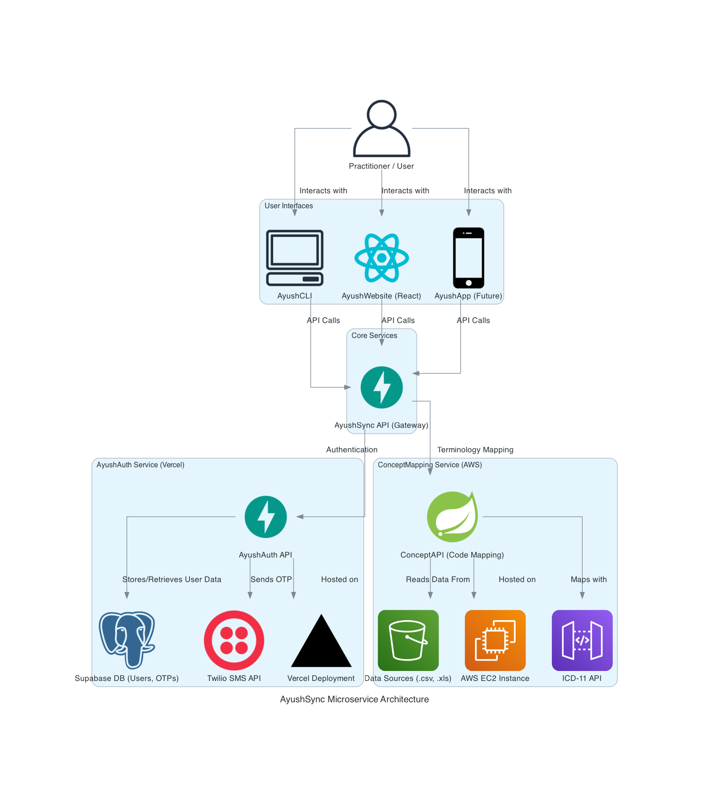

# AyushSync API

**AyushSyncAPI** is a lightweight, FHIR R4–compliant terminology micro-service for India’s AYUSH and WHO ICD-11 (TM2 \& Biomedicine) clinical vocabularies. It enables Electronic Medical Record (EMR) systems to integrate, search, and map traditional medicine diagnoses (Ayurveda, Siddha, Unani) using NAMASTE codes, and automatically link them with global ICD-11 codes for true dual-coding, analytics, and interoperability.

***

## Architecture Diagram

***

## Features

- **FHIR R4 compliant resources** for NAMASTE, ICD-11 TM2 \& Biomedicine codes.
- **Auto-complete REST endpoints** for searching AYUSH and ICD-11 codes.
- **Bidirectional mapping** between NAMASTE and ICD-11 (TM2) codes.
- **FHIR Bundle upload endpoint** for dual-coded encounters.
- **OAuth 2.0 and ABHA ID authentication** for secure API access.
- **Audit-ready metadata** for consent and version tracking.
- **Web/CLI demo interface** for term lookup, mapping, and FHIR ProblemList generation.

***

## Why AyushBridge?

- Bridges AYUSH (India’s traditional medicine) and global digital health ecosystems.
- Enables India’s healthcare providers and EMRs to code, analyze, and claim insurance for traditional as well as biomedical conditions—using a single, standards-based service.
- Powers analytics, research, and reporting for Ministry of Ayush, insurance, and public health.

***

## System Workflow

1. **Code Ingestion and Mapping**
The `ConceptMapping Service`, built with **Spring Boot** and deployed on AWS, is responsible for handling the terminology mapping. It ingests the NAMASTE codes from CSV files and uses the **ICD-11 API** to synchronize and map the codes.

2. **Auto-complete and Translation**
The REST API endpoints, powered by the `ConceptMapping Service`, allow users to search, look up, and translate between AYUSH (NAMASTE) and ICD-11 codes.

3. **FHIR Bundle Upload**
Securely upload dual-coded clinical encounters for record-keeping and analytics, following EHR 2016 standards.

4. **Web/CLI Demo Interface**
Test and demonstrate code search, mapping, and ProblemList entry creation.

***

## AyushAuth Workflow

The AyushAuth service handles user authentication and authorization. It uses a passwordless, OTP-based system for both registration and login. Here's a step-by-step breakdown of the process:

1.  **User Initiates Login/Registration:** The user enters their ABHA ID (Health ID) in the AyushCLI or AyushWebsite.
2.  **Request to AyushAuth API:** The client sends the ABHA ID to the `/auth/otp/send` endpoint of the AyushAuth API.
3.  **OTP Generation and Storage:**
    *   The AyushAuth API generates a random 6-digit One-Time Password (OTP).
    *   It securely stores the OTP and its expiry time in the `otps` table in the Supabase database, associated with the user's ABHA ID.
4.  **OTP Delivery via Twilio:** The API sends the generated OTP to the user's registered mobile number via the Twilio SMS API.
5.  **User Enters OTP:** The user receives the OTP on their mobile device and enters it into the client application.
6.  **OTP Verification:** The client sends the ABHA ID and the entered OTP to the `/auth/otp/verify` endpoint of the AyushAuth API.
7.  **JWT Generation:**
    *   The AyushAuth API verifies the OTP against the value stored in the Supabase database.
    *   If the OTP is valid and not expired, the API checks if a user with the given ABHA ID already exists in the `users` table.
    *   If the user doesn't exist, a new user record is created.
    *   A JSON Web Token (JWT) is generated, containing the user's ID and other relevant claims. The JWT is signed with a secret key.
8.  **Session Management:** The AyushAuth API returns the JWT to the client. The client stores the JWT securely (e.g., in `localStorage` or a secure cookie) and includes it in the `Authorization` header of subsequent requests to the AyushSync API.
9.  **Authenticated Requests:** The AyushSync API (acting as a gateway) validates the JWT on each incoming request before proxying the request to the appropriate downstream service (e.g., ConceptMapping Service).

This entire workflow is designed to be secure, scalable, and user-friendly, providing a seamless authentication experience without the need for passwords.

***

## API Endpoints

- `GET /codes/search?query=<term>&type=namaste|icd` – Search and auto-complete codes
- `POST /codes/translate` – Map between NAMASTE and TM2 codes
- `POST /fhir/bundle/upload` – Securely upload FHIR Bundles (dual-coded)
- OAuth 2.0 endpoints for ABHA authentication

***

## Compliance

- **Meets India’s 2016 EHR standards** (FHIR R4, ISO 22600, SNOMED CT, LOINC)
- **Consent and version tracking** within all core data operations

***

## Getting Started

1. **Clone the repository**
2. **Install dependencies**
*(Python/Node/Java, depending on your backend framework)*
3. **Configure OAuth 2.0 and ABHA endpoints**
4. **Run the migration to ingest NAMASTE and ICD-11 code data**
5. **Start the API service**
6. **Access API docs and sample CLI/Web interface for demo**

***

## License

Released under the [MIT](https://opensource.org/license/mit) License.

***

## Contributors

- Ministry of Ayush, Government of India
- Open-source digital health community

***

## Acknowledgements

- [NAMASTE Portal, Ministry of AYUSH](https://namaste.ayush.gov.in)
- [WHO ICD-11 API](https://icd.who.int/icdapi)

***

For more information, technical questions, or contribution guidelines, please refer to the `/docs` directory or raise an issue in this repository.

⁂

